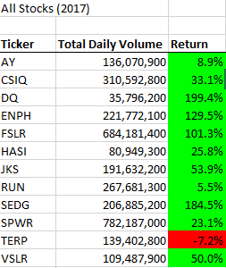
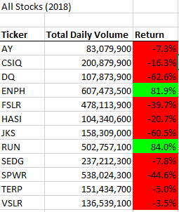
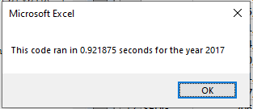
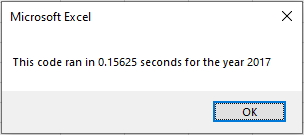
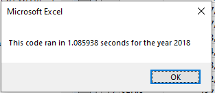
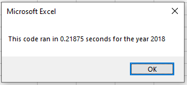
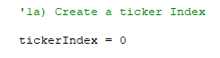

# Stock Analysis
## Overview of Project
### Purpose
The purpose of this analysis was to assess 2017 and 2018 stock performance for specific stocks, as well as the performance of refactored code developed to analyze the stock dataset. Execution times for the original VBA script and the edited, or refactored, version were compared.
### Background Details
The original script developed allowed the client to analyze total daily volumes and start and end prices for twelve green stocks. However, to expand the dataset to include a few years worth of data for the entire stock market whcih includes thousands of stocks, the code had to be refactored to ensure the client could perform future analysis and run the VBA script with reasonable execution times.
## Results
### 2017 and 2018 Stock Performance
As depicted in the screenshots below, the stocks in the dataset performed differently in 2017 compared to 2018, with 2017 providing more positive rates of returns than 2018.

### Execution Times for Refactored vs Original VBA Script
As you can see in the images below, the refactored script ran significantly faster than the original code.
Run-time for 2017 with original code...

vs refactored...

Run-time for 2018 with original code...

vs refactored...

The actual refactored portion of the code was miniscule, and included diong away with the nest for loop of the original code using a tickerIndex.

## Summary
### Pros and Cons of Refactoring
There are many advantages to refactoring code. A few include:
- resulting code has reduced complexity, lending to improved readability
- maintainability is improved
- code has faster execution speeds,
- results ins a simplier, cleaner design

One major disadvantage of refactoring is that it can be time consuming. Additionally, you may have to retest functionality of the code.

### Applicaton of Pros and Cons in This Project's Refactored VBA Script
When refactoring the original VBA script, the final product did accomplish faster execution times as suspected based on the list above.
It also, however, was time consuming, which was a listed con.
